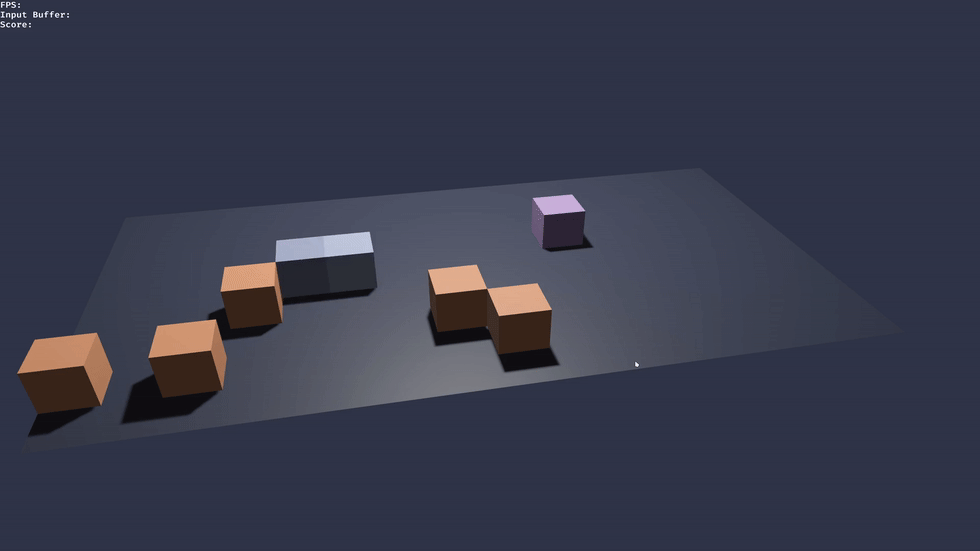

# Bevy Snake Game

This project is a 2D/3D snake implementation with the Bevy game engine.
It's currently a work in progress but it includes some extra features like teleporters.



## Usage

   ```sh
   cargo run --release
   ```
## Dependencies

- `rust`: [Rust toolchain](https://www.rust-lang.org/tools/install).
- `bevy`: A data-driven game engine built in Rust.
